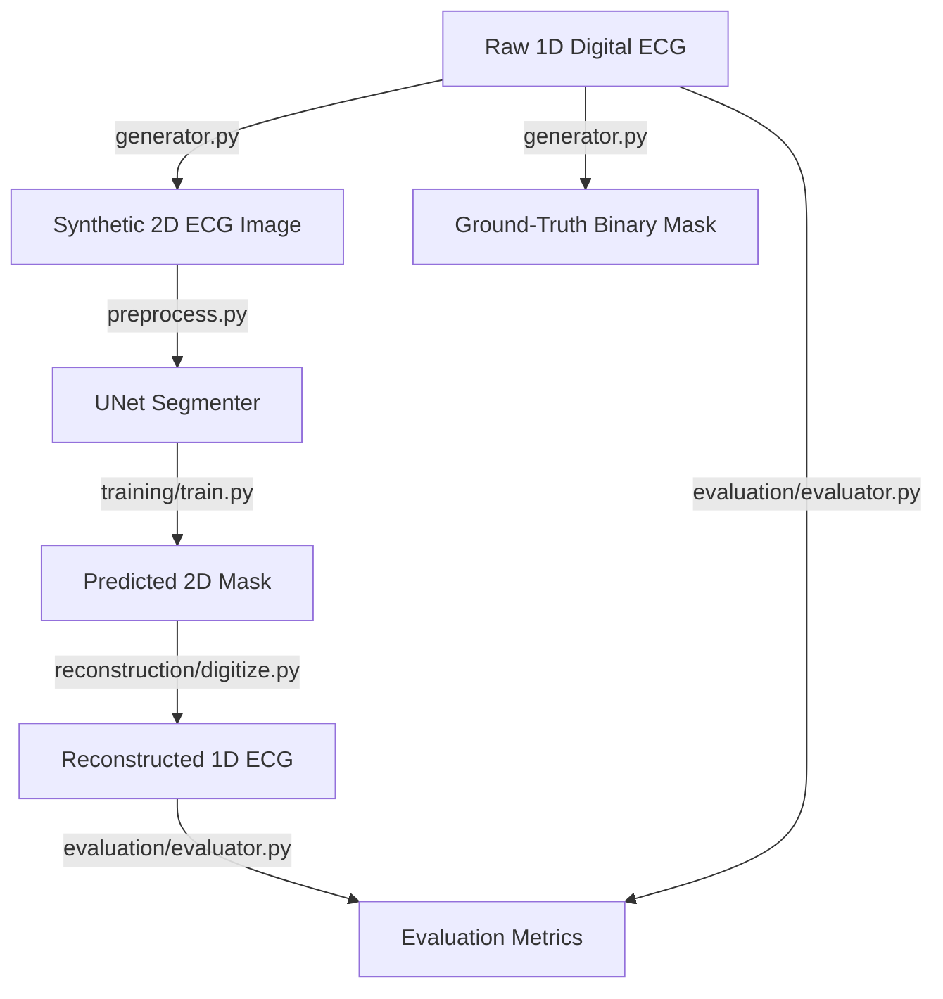

# ECG-Image-Digitization

[](LICENSE)
[](https://tensorflow.org)
[](https://python.org)

A modular, publication-ready research pipeline to digitize historical and paper-based Electrocardiogram (ECG) records into high-fidelity 1D digital time-series signals. This project leverages a UNet semantic segmentation model implemented in TensorFlow/Keras to extract signal curves from grid paper backgrounds, combined with robust post-processing reconstruction algorithms.

---

## 📌 Project Overview

Digitizing paper ECG records is a critical task for integrating historical medical charts into modern Electronic Health Record (EHR) databases and enabling retrospective analysis using state-of-the-art AI diagnostics. This repository provides a complete end-to-end framework:

1. **Synthetic ECG Generator**: Translates raw digital 1D ECG signals (e.g., from the PTB-XL dataset) into realistic 2D printed ECG paper images with customizable grid sizes, lead layouts, noise, and paper deformities.
2. **UNet Segmenter**: A deep neural network that performs semantic segmentation, isolating the black ink curves of the ECG trace from the grid lines and paper background.
3. **1D Signal Reconstruction**: A peak-detection and pixel-to-time/voltage translation algorithm that reads the segmented binary mask and outputs a calibrated 1D digital signal.
4. **Evaluator**: Compares reconstructed digital signals against original 1D waveforms using metrics such as Root Mean Squared Error (RMSE), Cosine Similarity, Pearson Correlation, and Signal-to-Noise Ratio (SNR).

---

## 🛠️ Repository Directory Structure

```text
ECG-Image-Digitization/
├── configs/                   # Directory for storing specialized YAML configuration variations
├── dataset/                   # Data directory (ignored by git, except directory structure)
│   ├── ptbxl/                 # Raw PTB-XL digital recordings (e.g., dat/hea files)
│   ├── generated_images/      # Synthetic ECG images generated from digital signals
│   ├── masks/                 # Ground-truth binary segmentation masks
│   ├── signals/               # Ground-truth 1D signal waveforms (NumPy format)
│   ├── train/                 # Train split folders
│   ├── val/                   # Validation split folders
│   └── test/                  # Test split folders
├── notebooks/                 # Jupyter Notebooks for exploration and qualitative analysis
├── outputs/                   # Output artifacts
│   ├── predictions/           # Model-predicted segmentation masks
│   ├── plots/                 # Visual comparisons (original vs. mask vs. reconstructed)
│   └── reconstructed_signals/ # Reconstructed 1D signal files (CSV/NumPy format)
├── saved_models/              # Model checkpoints and trained H5/keras weights
├── src/                       # Main source code directory
│   ├── dataset/               # Data generation and preprocessing pipeline
│   │   ├── __init__.py
│   │   ├── generator.py       # ECG paper rendering and noise injection
│   │   └── preprocess.py      # TF.data loader, augmentation, and resizing
│   ├── models/                # Deep Learning architecture
│   │   ├── __init__.py
│   │   ├── metrics.py         # Custom metrics (Dice coefficient, Hybrid loss)
│   │   └── unet.py            # UNet architecture definition
│   ├── training/              # Optimization routines
│   │   ├── __init__.py
│   │   └── train.py           # Orchestrates training, logging, and checkpointing
│   ├── reconstruction/        # Post-segmentation translation
│   │   ├── __init__.py
│   │   └── digitize.py        # Converts 2D pixel mask back to 1D time-series
│   ├── evaluation/            # Validation & benchmarks
│   │   ├── __init__.py
│   │   └── evaluator.py       # Signal comparison and statistical reporting
│   └── utils/                 # Auxiliary modules
│       ├── __init__.py
│       └── helpers.py         # Logger, YAML parser, plotting helpers
├── config.yaml                # Global pipeline configuration
├── requirements.txt           # Python dependency file
├── .gitignore                 # Files excluded from git tracking
├── LICENSE                    # MIT License file
└── README.md                  # This file
```

---

## 🔬 Methodology & Architecture



### 1. Data Synthesis & Augmentation
Due to the rarity of paired paper-digital clinical datasets, the project includes a synthetic renderer (`src/dataset/generator.py`). Using raw waveform amplitudes:
- Custom gridlines are drawn (1mm minor grids, 5mm major grids).
- Traces are plotted in standard layouts (e.g., 3 columns x 4 rows + 1 rhythm lead).
- Augmentations include random rotation, perspective warp, shadows, lighting changes, wrinkles, and background noise.

### 2. Neural Network Segmentation
The core segmentation model is a **UNet** (`src/models/unet.py`). 
- **Encoder**: Successive convolutional blocks with Max-Pooling to extract high-level feature maps.
- **Decoder**: Up-convolutional (transposed convolution) layers with skip connections from the encoder to restore spatial resolution.
- **Loss**: Dice Loss or Dice-BCE Hybrid Loss (`src/models/metrics.py`) to handle class imbalance (as signal curves occupy only a small fraction of the image canvas).

### 3. Digitization & Signal Reconstruction
Given the predicted probability map from the model, post-processing (`src/reconstruction/digitize.py`):
1. Thresholds the probabilities to obtain a binary mask.
2. Identifies the grid coordinate system using the standard paper dimension (e.g., 25 mm/sec speed, 10 mm/mV scale).
3. Separates the grid into individual lead bounding boxes.
4. Performs column-wise centroid extraction or contour tracing to estimate the curve heights.
5. Fills in missing segments using cubic spline interpolation.

---

## 🚀 Getting Started

### 📋 Prerequisites
- Python 3.9 or higher
- CUDA-compatible GPU (Highly recommended for UNet training)

### ⚙️ Installation

1. Clone this repository:
   ```bash
   git clone https://github.com/yourusername/ECG-Image-Digitization.git
   cd ECG-Image-Digitization
   ```

2. Create and activate a virtual environment:
   ```bash
   python -m venv venv
   source venv/bin/activate  # On Windows use `venv\Scripts\activate`
   ```

3. Install the dependencies:
   ```bash
   pip install --upgrade pip
   pip install -r requirements.txt
   ```

### 🏃 Running the Pipeline

1. **Configure Parameters**:
   Adjust configurations in `config.yaml` to specify image properties, model filters, batch sizes, and training epochs.

2. **Generate Synthetic Dataset**:
   To generate mock images from PTB-XL (or raw signals) for training:
   ```bash
   python -m src.dataset.generator --config config.yaml
   ```

3. **Train the UNet Model**:
   Run training to optimize weights on the synthetic/scanned images:
   ```bash
   python -m src.training.train --config config.yaml
   ```

4. **Digitize Test Images**:
   Digitize new ECG images into raw signal data:
   ```bash
   python -m src.reconstruction.digitize --image_path dataset/test/sample.png --config config.yaml
   ```

5. **Evaluate Quality**:
   Evaluate reconstructed signals against the ground truth:
   ```bash
   python -m src.evaluation.evaluator --config config.yaml
   ```

---

## 📈 Evaluation Metrics

The reconstruction quality is evaluated quantitatively using:
- **Root Mean Squared Error (RMSE)**: Measures amplitude deviation.
- **Pearson Correlation Coefficient ($r$)**: Validates morphological shape agreement.
- **Signal-to-Noise Ratio (SNR)**: Computes reconstruction noise presence.

---

## 📄 Citation & Publication

If you use this codebase or model configurations in your research, please cite:

```bibtex
@article{sharma2026ecgdigitization,
  title={Deep Learning-based Digitization of Paper ECGs using UNet Architectures},
  author={Sharma, Ganesh},
  journal={arXiv preprint arXiv:XXXX.XXXXX},
  year={2026}
}
```
